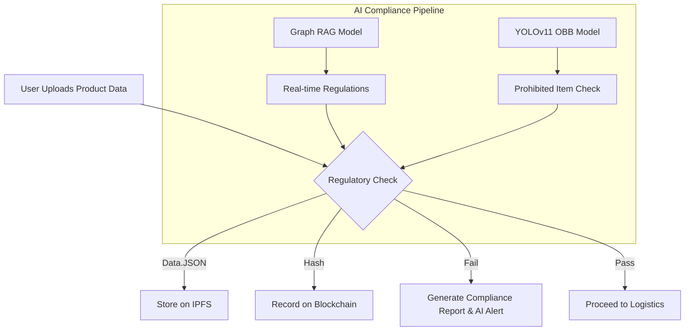
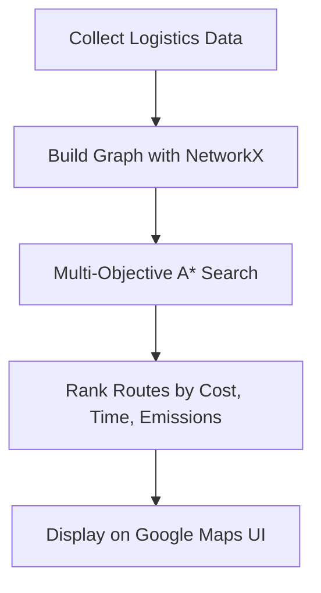
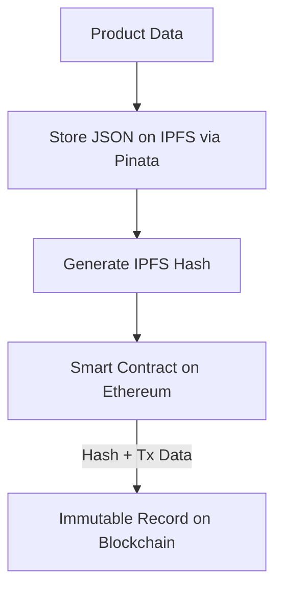
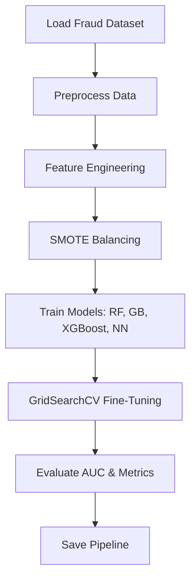
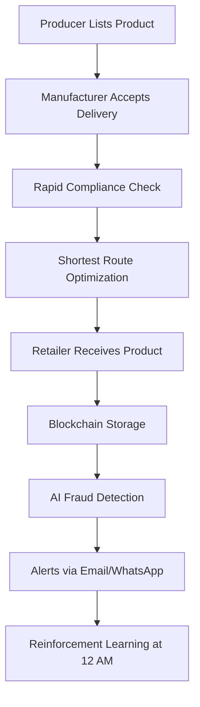
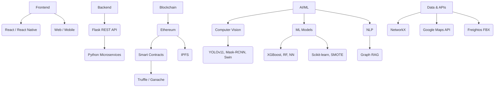
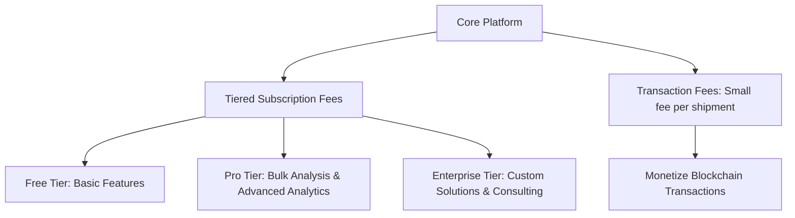

# 📦 Blockchain-Based Supply Chain with AI Fraud Detection


[](https://www.google.com/search?q=https://github.com/your-username/your-repo/actions)
[](https://www.google.com/search?q=https://github.com/your-username/your-repo/actions)
[](https://opensource.org/licenses/MIT)
[](https://www.python.org/)
[](https://ethereum.org/)
[](https://reactjs.org/)
[](https://flask.palletsprojects.com/)

This project delivers a **blockchain-powered supply chain system** integrated with **AI-driven fraud detection** and **optimized logistics**. Our platform ensures transparency, authenticity, and efficiency for businesses by tracking products end-to-end and leveraging cutting-edge AI and blockchain to eliminate fraud and streamline operations.

-----

## 📋 Table of Contents

  * [🌟 Project Overview](https://www.google.com/search?q=%23-project-overview)
  * [🚀 Core Features](https://www.google.com/search?q=%23-core-features)
      * [1. Rapid Compliance Check](https://www.google.com/search?q=%231-rapid-compliance-check-)
      * [2. Shortest Route Optimization](https://www.google.com/search?q=%232-shortest-route-optimization-)
      * [3. Blockchain Security](https://www.google.com/search?q=%233-blockchain-security)
      * [4. AI-Powered Surveillance & Fraud Detection](https://www.google.com/search?q=%234-ai-powered-surveillance--fraud-detection)
  * [🎨 Architecture & Workflow](https://www.google.com/search?q=%23-architecture--workflow)
  * [🛠️ Tech Stack](https://www.google.com/search?q=%23%EF%B8%8F-tech-stack)
  * [📈 Why This Project Matters](https://www.google.com/search?q=%23-why-this-project-matters)
  * [💼 Monetization Strategy](https://www.google.com/search?q=%23-monetization-strategy)
  * [⚙️ Getting Started](https://www.google.com/search?q=%23%EF%B8%8F-getting-started)
  * [🤝 Contributing](https://www.google.com/search?q=%23-contributing)
  * [📜 License](https://www.google.com/search?q=%23-license)

-----

## 🌟 Project Overview

The global supply chain industry loses billions annually to fraud and inefficiencies. Our solution combines **Ethereum blockchain**, **IPFS for decentralized storage**, and **AI-powered compliance and fraud detection** to create a robust, scalable platform.

This system addresses key industry challenges by:

  * **Tracking product authenticity** through an immutable, decentralized ledger.
  * **Leveraging AI** to proactively detect and prevent fraudulent transactions.
  * **Ensuring transparency** for all stakeholders—producers, manufacturers, and retailers.

-----

## 🚀 Core Features

### 1\. Rapid Compliance Check (Star Feature 🔥)

Our AI-powered Rapid Compliance Checker automates and simplifies the complex process of international shipping, ensuring accuracy and regulatory adherence.

  * **Real-Time Compliance Knowledge Base:** A **Graph RAG Model** continuously scrapes and retrieves real-time regulatory information from government portals, shipping companies (FedEx, UPS), and other international bodies.
  * **AI-Powered Prohibited Item Checker:** A fine-tuned **YOLOv11 OBB model** (99.2% accuracy) detects items from uploaded images, flagging country-specific restricted or banned goods.
  * **Bulk Analysis & Automation:** Users can upload a CSV for bulk analysis of shipments. The system then generates compliance reports and sends automated AI-powered alerts via email or WhatsApp.
  * **Multilingual Support:** The platform supports multiple languages (French, Spanish, Chinese, Hindi) to cater to global businesses.

<!-- end list -->



### 2\. Shortest Route Optimization (Star Feature 🎯)

This feature optimizes product delivery routes by balancing multiple objectives like cost, time, and sustainability.

  * **Graph-Based Modeling:** A logistics network is built using **NetworkX**, which incorporates data from 71 seaports, 105 airports, and thousands of global routes.
  * **Multi-Objective A\* Search:** The algorithm analyzes transport data, WTO customs scores, and World Bank logistics data to provide a ranked list of optimal routes.
  * **Smart Routing:** The system can suggest eco-friendly routes or prioritize faster routes for perishable goods. Route maps are displayed via **Google Maps API** integration.

<!-- end list -->



### 3\. Blockchain Security

  * **Ethereum Blockchain:** All transactions and product data are recorded on the Ethereum blockchain, creating an immutable and transparent ledger.
  * **IPFS (Pinata):** Product data files (`data.json`) are stored on the InterPlanetary File System, with only the unique, tamper-proof hash stored on the blockchain, saving on gas fees while ensuring data integrity.
  * **Smart Contracts:** Developed with **Truffle** and tested on **Ganache**, these contracts automate the transfer of goods and verify transactions to prevent fraud.

<!-- end list -->



### 4\. AI-Powered Surveillance & Fraud Detection

An additional security layer using advanced computer vision and reinforcement learning.

  * **Multi-Model Analysis:** The system uses a combination of models to identify fraudulent activities:
      * **Semantic Segmentation (Mask-RCNN):** Identifies objects in surveillance footage.
      * **Classification (Swin Transformer):** Classifies potential fraudulent activities or anomalies.
      * **Object Detection (YOLOv11 OBB):** Detects specific fraudulent activities with high precision.
  * **Proactive Prevention:** A reinforcement learning model, run nightly, learns behavioral patterns to proactively identify and prevent future fraud attempts.
  * **Real-time Alerts:** The system sends immediate fraud notifications via email and WhatsApp.

<!-- end list -->



-----

## 🎨 Architecture & Workflow

### End-to-End Supply Chain Flow



-----

## 🛠️ Tech Stack



-----

## 📈 Why This Project Matters

**Feasibility:** Built with mature technologies and scalable AI models, the project is technically sound. It leverages open-source logistics data and microservices to ensure performance at scale.

**Viability:** The solution addresses a critical market need by combating supply chain fraud and inefficiency. By automating compliance and route optimization, it offers significant cost savings and aligns with global sustainability initiatives.

**Unique Selling Proposition (USP):**

  * End-to-end transparency with AI-driven fraud prevention.
  * Seamless compliance and logistics optimization in a single platform.
  * Mobile and web accessibility for all stakeholders.

-----

## 💼 Monetization Strategy



-----

## ⚙️ Getting Started

### Prerequisites

  * Python 3.8+
  * Node.js
  * Truffle & Ganache
  * Ethereum wallet (e.g., MetaMask)
  * Pinata API key

### Installation

1.  **Clone the repository:**

    ```bash
    git clone https://github.com/your-username/blockchain-supply-chain.git
    cd blockchain-supply-chain
    ```

2.  **Set up the backend:**

    ```bash
    pip install -r requirements.txt
    python app.py
    ```

3.  **Set up the web frontend:**

    ```bash
    cd web-app
    npm install
    npm start
    ```

4.  **Set up the mobile app:**

    ```bash
    cd mobile-app
    npm install
    npx react-native run-android # or run-ios
    ```

5.  **Blockchain setup:**

      * Install Ganache and Truffle.
      * Navigate to the `blockchain/` directory and follow the instructions to compile, migrate, and deploy the smart contracts.

6.  **Configuration:**

      * Add your Pinata API key and Google Maps API key to the relevant configuration files.

For detailed instructions, refer to the `docs/` folder.

-----

## 🤝 Contributing

We welcome contributions\! Please feel free to open a pull request or submit an issue on this repository.

-----

## 📜 License

This project is licensed under the MIT License. See the `LICENSE` file for details.
