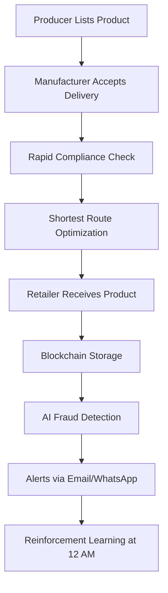
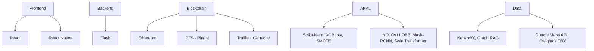
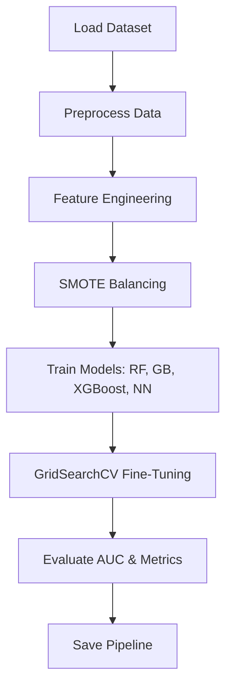
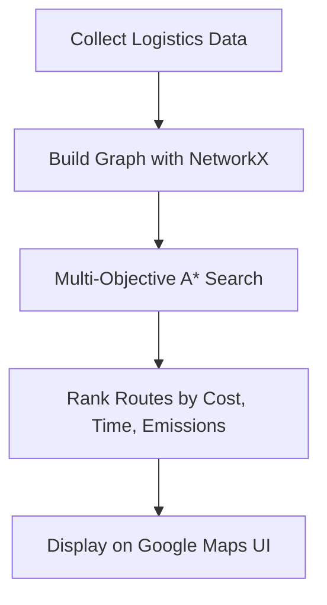
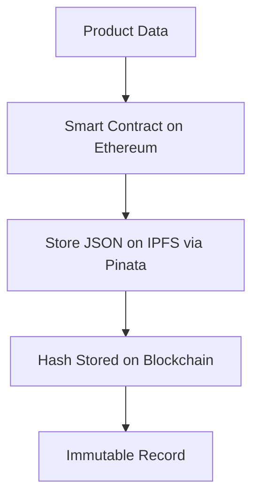

# rgit_codeastra_2k25

Ports: 3000: vinayak/agent.py

vinayak_codeastra: 5001
anushka: 5000
harshit: 6001
harshit3: 6002

Below is a comprehensive GitHub README for your project, incorporating all the details you provided, including 5-6 Mermaid diagrams, structured sections, and a professional yet engaging tone. I’ve ensured it captures your problem statement, features, tech stack, workflows, and business value.

---

# Blockchain-Based Supply Chain with AI Fraud Detection

Welcome to the future of supply chain management! This project delivers a **blockchain-powered supply chain system** integrated with **AI-driven fraud detection** and **optimized logistics**, ensuring transparency, authenticity, and efficiency for businesses worldwide. Built for producers, manufacturers, and retailers, our platform tracks products end-to-end while leveraging cutting-edge AI and blockchain to eliminate fraud and streamline operations.

---

## 🌟 Project Overview

Imagine a world where supply chains are transparent, fraud-free, and optimized for speed, cost, and sustainability. Our solution combines **Ethereum blockchain**, **IPFS for decentralized storage**, and **AI-powered compliance and fraud detection** to create a robust, scalable platform. Whether you're a producer listing goods, a manufacturer ensuring compliance, or a retailer receiving authentic products, this system has you covered.

### Problem Statement
Build a blockchain-powered supply chain management system that:
- Tracks product authenticity.
- Uses AI to detect fraudulent transactions.
- Ensures transparency across producers, manufacturers, and retailers.

---

## 🚀 Core Features

### 1. Supply Chain Management Website & React Native App
- A full-fledged platform for **producers**, **manufacturers**, and **retailers**.
- List products, track deliveries, and manage workflows seamlessly.
- Available as a **web app (Flask + React)** and **mobile app (React Native)**.

### 2. Rapid Compliance Check (Star Feature 🔥)
Imagine seamless international shipments with zero compliance guesswork. Our AI-powered Rapid Compliance Checker automates and simplifies compliance, ensuring accuracy and regulatory adherence.

- **Real-Time Compliance Knowledge Base**
  - Sources: Government portals, FedEx, UPS, international regulations.
  - Graph RAG Model: AI-driven retrieval of country-specific rules.
  - Interactive Chatbot: Memory-enabled compliance queries.
- **AI-Powered Prohibited Item Checker**
  - Country-wise restricted item checks.
  - Item-based ban list search.
  - Export options: PDF, CSV, WhatsApp, SMS.
- **Image-Based Compliance Analysis**
  - YOLOv11 OBB model (99.2% accuracy) detects items from uploaded images.
  - Dynamic country-wise ban reports with graphical insights.
- **Bulk Shipment Compliance & Admin Panel**
  - CSV upload for bulk analysis.
  - Admin controls for dynamic rule updates.
  - Microservices architecture for parallel processing.
- **AI Agents & Automated Reports**
  - Real-time scraping of 22+ FedEx rules.
  - Reinforcement learning for self-improving insights.
  - AI-generated compliance emails.
- **Multilingual Support**
  - French, Spanish, Chinese, Hindi, and more.
  - WhatsApp, SMS, and email integration.

### 3. Shortest Route Optimization (Star Feature 🎯)
A node-based graph model optimizes product delivery routes, balancing cost, time, emissions, and logistics scores.

- **Objectives**
  - Gather clean transport data.
  - Optimize cross-border routes.
  - Provide a user-friendly route mapping interface.
- **Data Sources**
  - 71 seaports, 105 airports, 1932 sea routes, 10,920 air routes.
  - WTO customs scores, World Bank logistics data, Freightos FBX Index.
- **Graph-Based Modeling**
  - NetworkX-powered fully connected logistics network.
  - Multi-objective A* search algorithm for route optimization.
- **Features**
  - Ranked routes with cost, time, and emissions metrics.
  - Google Maps API integration.
  - Eco-friendly and perishable goods routing options.

### 4. Blockchain Security
- **Ethereum Blockchain**: Securely stores all transactions and product data.
- **IPFS (Pinata)**: Decentralized storage for `data.json` files.
- **Smart Contracts**: Written with Truffle and tested locally via Ganache to prevent fraud at every step.

### 5. AI-Powered Surveillance & Fraud Detection
An additional security layer using advanced computer vision and reinforcement learning.

- **Semantic Segmentation**: Mask-RCNN identifies objects in surveillance footage.
- **Classification**: Swin Transformer classifies potential fraud.
- **Object Detection**: Fine-tuned YOLOv11 OBB detects fraudulent activities.
- **AI Alerts**: Fraud notifications sent via email and WhatsApp.
- **Reinforcement Learning**: Cron job at 12 AM learns behavioral patterns for proactive fraud prevention.

---

## 🎨 Workflow

Here’s how it all ties together:

---

## 🌟 Distinguishing Features

- **Rapid Compliance Check**: AI-driven, real-time compliance with 99.2% accuracy.
- **Route Optimization**: Balances cost, time, and sustainability dynamically.
- **Blockchain + IPFS**: Tamper-proof, decentralized data storage.
- **AI Surveillance**: Multi-model fraud detection (Mask-RCNN, Swin Transformer, YOLOv11 OBB).
- **Multilingual & Accessible**: Supports global businesses with WhatsApp/SMS integration.

---

## 🛠️ Tech Stack

- **Frontend**: React (web), React Native (mobile)
- **Backend**: Flask
- **Blockchain**: Ethereum, IPFS (Pinata), Truffle, Ganache
- **AI/ML**: Scikit-learn, XGBoost, SMOTE, YOLOv11 OBB, Mask-RCNN, Swin Transformer
- **Data Processing**: NetworkX, Graph RAG, Pandas, NumPy
- **APIs**: Google Maps, Freightos FBX, WTO, World Bank

---

## 📈 Feasibility & Viability

### Feasibility
- **Technical**: Built with mature technologies (Ethereum, Flask, React) and scalable AI models.
- **Data Availability**: Leverages open-source logistics data and real-time APIs.
- **Scalability**: Microservices and parallel processing ensure performance at scale.

### Viability
- **Market Need**: Businesses lose billions to supply chain fraud annually—our solution addresses this.
- **Cost-Effectiveness**: Automates compliance and routing, reducing manual overhead.
- **Sustainability**: Eco-friendly routing aligns with global green initiatives.

---

## 💼 Business Model

### How It’s Useful for Businesses
- **Producers**: Prove product authenticity and track shipments.
- **Manufacturers**: Ensure compliance and optimize logistics.
- **Retailers**: Receive verified goods faster and cheaper.
- **Global Reach**: Multilingual support for international trade.

### Revenue Streams
1. **Subscription**: Monthly fees for premium features (bulk compliance, advanced analytics).
2. **Transaction Fees**: Per shipment tracked on the blockchain.
3. **Consulting**: Custom compliance and logistics solutions for enterprises.

### Unique Selling Proposition (USP)
- End-to-end transparency with AI-driven fraud prevention.
- Seamless compliance and logistics optimization in one platform.
- Mobile and web accessibility for all stakeholders.

---

## ⚙️ AI Fraud Detection Model

Our AI model detects fraudulent transactions with high accuracy. Here’s the pipeline:

- **Code**: See `ai_fraud_detection.py` for the full implementation.
- **Models**: Random Forest, Gradient Boosting, XGBoost, Neural Network.
- **Metrics**: AUC, precision, recall, confusion matrix.

---

## 🌍 Route Optimization Workflow

---

## 🔒 Blockchain Integration

---

## 📲 Getting Started

### Prerequisites
- Python 3.8+
- Node.js
- Truffle & Ganache
- Ethereum wallet (e.g., MetaMask)
- Pinata API key

